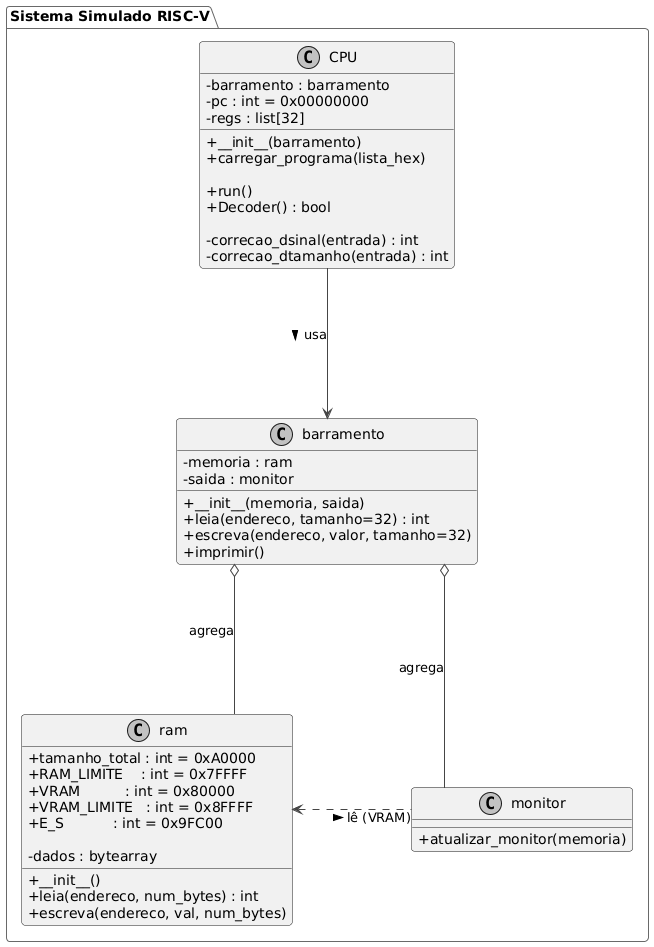
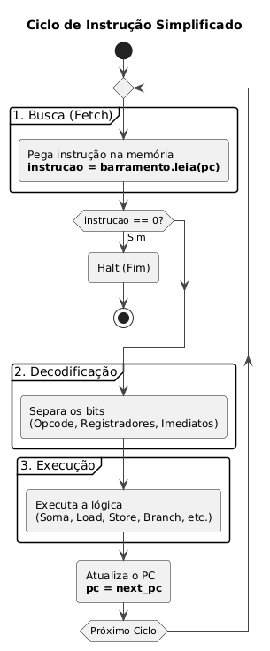

# Simulador de Processador RISC-V (RV32I)
Simulador do funcionamento de um processador RISC V em python
## Autores
* Raul Santos da Silva - RM: 8883414

Projeto final da disciplina de Organização de Computadores - Universidade Católica de Santos (UniSantos).

LINK PARA O VIDEO DO YOUTUBE:
https://youtu.be/1lVfVQvKvf8?si=S4oTBvlEocv6uWtC
## Sobre o Projeto
Este codigo contem a implementação de um simulador de um processador RISC-V 32bits I, versão do processador de 32 bits focada em instruções de numeros inteiros, **python**.

* Linguagem: Python

  
   
  <em>Figura 1: Estrutura de Classes do Simulador</em>

 

## Como Executar
Basta iniciar o arquivo **main.py** para rodar com o codigo default

### Pré-requisitos
Como o projeto não utiliza bibliotecas externas, basta ter o compilador/interpretador da linguagem instalada.

O ciclo de funcionamento do simulador imita um processador RISC-V real:
1. O ciclo inicia com a extração da informação da memória (Instruction Fetch).
2. O ciclo de busca padrão é executado de forma contínua (sem interrupções no fluxo básico).
3. Segue-se para a decodificação e execução conforme a especificação da arquitetura.

  
   
  <em>Figura 2: Fluxo simplificado do Ciclo de Busca e Execução</em>

## Funcionalidades Implementadas

### 1. CPU (RV32I)
Abaixo, a lista completa das instruções implementadas no decodificador, organizadas por categoria e formato de instrução.

### Tabela de Instruções Suportadas (Detalhada)

| Opcode (Hex) | Funct3 | Funct7 | Instrução | Tipo | Descrição |
| :---: | :---: | :---: | :--- | :---: | :--- |
| **`0x03`** | `000` | - | `LB` | I | Load Byte |
| | `001` | - | `LH` | I | Load Half |
| | `010` | - | `LW` | I | Load Word |
| | `100` | - | `LBU` | I | Load Byte Unsigned |
| | `101` | - | `LHU` | I | Load Half Unsigned |
| **`0x13`** | `000` | - | `ADDI` | I | Add Immediate |
| | `001` | `0000000` | `SLLI` | I | Shift Left Logical Imm |
| | `010` | - | `SLTI` | I | Set Less Than Imm |
| | `011` | - | `SLTIU` | I | Set Less Than Imm Unsigned |
| | `100` | - | `XORI` | I | XOR Immediate |
| | `101` | `0000000` | `SRLI` | I | Shift Right Logical Imm |
| | `101` | `0100000` | `SRAI` | I | Shift Right Arith Imm |
| | `110` | - | `ORI` | I | OR Immediate |
| | `111` | - | `ANDI` | I | AND Immediate |
| **`0x17`** | - | - | `AUIPC` | U | Add Upper Imm to PC |
| **`0x23`** | `000` | - | `SB` | S | Store Byte |
| | `001` | - | `SH` | S | Store Half |
| | `010` | - | `SW` | S | Store Word |
| **`0x33`** | `000` | `0000000` | `ADD` | R | Add |
| | `000` | `0100000` | `SUB` | R | Subtract |
| | `001` | `0000000` | `SLL` | R | Shift Left Logical |
| | `010` | `0000000` | `SLT` | R | Set Less Than |
| | `011` | `0000000` | `SLTU` | R | Set Less Than Unsigned |
| | `100` | `0000000` | `XOR` | R | XOR |
| | `101` | `0000000` | `SRL` | R | Shift Right Logical |
| | `101` | `0100000` | `SRA` | R | Shift Right Arithmetic |
| | `110` | `0000000` | `OR` | R | OR |
| | `111` | `0000000` | `AND` | R | AND |
| **`0x37`** | - | - | `LUI` | U | Load Upper Immediate |
| **`0x63`** | `000` | - | `BEQ` | B | Branch == |
| | `001` | - | `BNE` | B | Branch != |
| | `100` | - | `BLT` | B | Branch < |
| | `101` | - | `BGE` | B | Branch >= |
| | `110` | - | `BLTU` | B | Branch < Unsigned |
| | `111` | - | `BGEU` | B | Branch >= Unsigned |
| **`0x67`** | `000` | - | `JALR` | I | Jump & Link Register |
| **`0x6F`** | - | - | `JAL` | J | Jump & Link |

### 2. Barramento
O código implementa uma única função que simula as operações dos três barramentos:
* Dados
* Endereço
* Controle

### 3. Sistema de Memória
A memória foi implementada como uma matriz de endereçamento, respeitando o seguinte mapeamento exigido no projeto:

| Faixa de Endereço (Hex) | Descrição |
|:-----------------------:|:----------|
| 0x00000 - 0x7FFFF       | RAM Principal (Programa, Dados, Pilha, Heap) |
| 0x80000 - 0x8FFFF       | VRAM (Vídeo RAM) |
| 0x90000 - 0x9FBFF       | Área Reservada para Expansões Futuras |
| 0x9FC00 - 0x9FFFF       | Periféricos (E/S Mapeada) |

Nota: A implementação no codigo não possui componentes que usam a Área Reservada e Periféricos (E/S Mapeada) estão apenas com seus endereços reservados porem sem utilização

### 4. Entrada e Saída (VRAM)
O simulador lê periodicamente a região da VRAM (0x80000) e exibe os caracteres ASCII correspondentes no terminal.

## 5. Programa de teste
O codigo conta com um programa de teste dentro do **main.py**
Esse codigo se traduz para um codigo em **python**:

https://github.com/rauS2/RISC-V-python/blob/3f03bb258d2f0981f6c9506f190854d404feb181/simulacao.py#L1-L9

